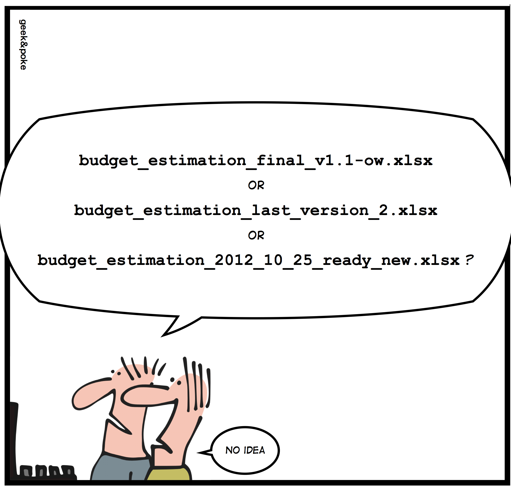
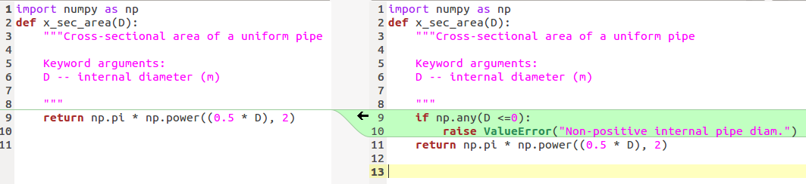
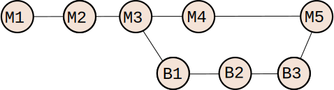

class: center, middle

# Version control systems

## Tools for tracking and managing the development of software

Will Furnass

Research Software Engineering team, University of Sheffield

2018-07-05

---
## Why bother with version control?

My filing technique is unstoppable!



(`http://geek-and-poke.com/2012/11/simply-explained.html`)

---
## Version control systems

* Tools for tracking changes to the files in a repository.
* Support for:
    * Viewing and comparing revisions of a project
    * Reverting files or the entire project to a previous state
    * Logging who, what, when and why for each set of changes
    * that are committed
    * Concurrent, collaborative development

---
## Use VCS when working on...

* Single script
* Collection of related scripts
* Simulation configuration files
* Software module
* Large program
* Documents (Markdown, L A TEX)
* Website (HTML; CSS; PHP)
* Files that are not just plain text?

---
## Available VCS

A few years ago:


<br />

2018: Git has won the war.  

Linux Torvalds, creator of Git: 

> I’m an egotistical bastard, and I name all my projects after myself. First Linux, now Git.

---
## Creating a repository

Want to create a Python module of functions relating to the modelling of hydraulics in drinking water pipes e.g.

```python
import numpy as np
def x_sec_area(D):
    """Cross-sectional area of a uniform pipe

    Keyword arguments:
    D -- internal diameter (m)
     
    """
    return np.pi * np.power((0.5 * D), 2)
```

---
Initialise a repository within that directory:

```
$ mkdir my_project
$ cd my_project
$ git init
Initialized empty Git repository in /home/will/my_project/.git/
```

Version control information hidden in `.git` directory.

---
## Committing a change to the repository

Add a new file to 'index' of files to track:

```
$ git add pyhyd.py
```

Create new revision of the project:

```
$ git commit -m "Created cross-sectional area function" 
```

---
All tracked files are now as per the most recent project revision:

```
$ git status 

# On branch master
nothing to commit (working directory clean)
```

Revision ID, author, date and comments stored in the log

```
$ git log

commit a6d126974f16d8c520a40bb737df37118126c6ff
Author : Will Furnass <will@thearete.co.uk>
Date :
 Tue Feb 26 19:57:15 2013 +0000
Created cross−sectional area function

```

---
## Making further changes (#1)

Add error handling to `pyhyd.py`:

```python
import numpy as np
def x_sec_area(D):
    """Cross-sectional area of a uniform pipe

    Keyword arguments:
    D -- internal diameter (m)
     
    """
    if np.any(D <=0):
        raise ValueError("Non-positive internal pipe diam.")
    return np.pi * np.power((0.5 * D), 2)
```

---
## Making further changes (#2)

Git knows the contents of the working directory differ from the most recently committed revision:

```
$ git status
# On branch master
# Changes not staged for commit:
#   (use "git add <file>..." to update what will be committed)
#   (use "git checkout -- <file>..." to discard changes in working directory)
#
#	modified:   pyhyd.py
#
no changes added to commit (use "git add" and/or "git commit -a")
```

---
## Making further changes (#3)

Need to add changes to git's 'index' (aka staging area)...

```
$ git add pyhyd.py
```

```
$ git status

# On branch master
# Changes to be committed:
#   (use "git reset HEAD <file>..." to unstage)
#
#	modified:   pyhyd.py
```

...before can commit another revision to the repository:

```
$ git commit -m "Error checking for invalid diameters"

[master cda239e] Error checking for invalid diameters
 1 file changed, 2 insertions(+)
```

---
```
$ git status 

# On branch master 
nothing to commit (working directory clean)
```

```
$ git hist

* cda239e 2013-02-26 | Error checking for invalid diameters (HEAD, master) [Will Furnass]
* a6d1269 2013-02-26 | Created cross-sectional area function [Will Furnass]
```

---
## Viewing previous revisions

Quickly view a previous **revision** of a project:

```
$ git checkout a6d126974f16d8c520a40bb737df37118126c6ff	
...
HEAD is now at a6d1269... Created cross-sectional area function
```

`pyhyd.py` now once again looks like: 

```python
:
import numpy as np
def x_sec_area(D):
    """Cross-sectional area of a uniform pipe

    Keyword arguments:
    D -- internal diameter (m)
     
    """
    return np.pi * np.power((0.5 * D), 2)
```

---
Switch back to viewing the most recent revision with:

```
$ git checkout master

Previous HEAD position was a6d1269... Created cross-sectional area function
Switched to branch 'master'
```

`HEAD` is an *alias* for the revision currently associated with the working directory (but the latter may also contain 'uncommitted' changes)

---
## Comparing revisions

Can see the lines that differ 

* between two revisions
* between files in current working directory and a particular revision

e.g. comparing the most recent two revisions:

```
$ git difftool -y --tool meld HEAD~1 HEAD
```


The **diff** for two files or for two revisions of effectively the same file are *the lines that differ between them*.

---
## Undoing changes

Made a mistake since the last commit? Scrap uncommitted changes made to a file with

```
$ git checkout -- pyhyd.py
```

Revert one or more commits and scrap all changes in the working directory using 

```
$ git reset --hard a6d126974f16d8c520a40bb737df37118126c6ff
```

---
## Branching and merging

1. Start with single line of development;
1. Create a **branch** to develop new feature;
1. Can now now develop new feature **in parallel** with fixing bugs in original code;
1. After developing and testing new feature, **merge** the new branch into the default (**master**) branch:



NB:
* Automatic merging usually successful but manual conflict resolution sometimes required
* Branching very useful if project developed by several people

---
## How to get started with VCS?

Software:

* **Cross-platform:** **GitKraken** is an excellent **graphical** Git client
* **Windows**: Install **Git Bash** (command-line) or use **TortoiseGit** GUI (w/ Windows Explorer integration)
* **Linux**: Easy to install command-line tool
* **macOS**: Install command-line tool or use **GitX** GUI

Development environment support:

* **MATLAB** and **RStudio**: built-in support!

Resources:

* *gitimmersion.com* tutorial 
* *Version Control by Example* book (http://www.ericsink.com/vcbe)

---
## Best practise

Advice from WANDisco (pertinent to single-developer projects):

* **Commit little and often**: Reduce risk and complexity of merge conflicts
* **Only commit finished work**: Never commit half-completed code: split tasks into manageable but logical pieces then commit these regularly.
* **Make use of log messages**: Include as much information as possible (what changes were made, why, and by whom, etc.) 

---
## Summary

* VCS are systems for tracking the changes made to a set of files.
* Each revision is the what, who, when and why for a set of changes.
* Useful if working on own or with others.

<br />
Questions?
